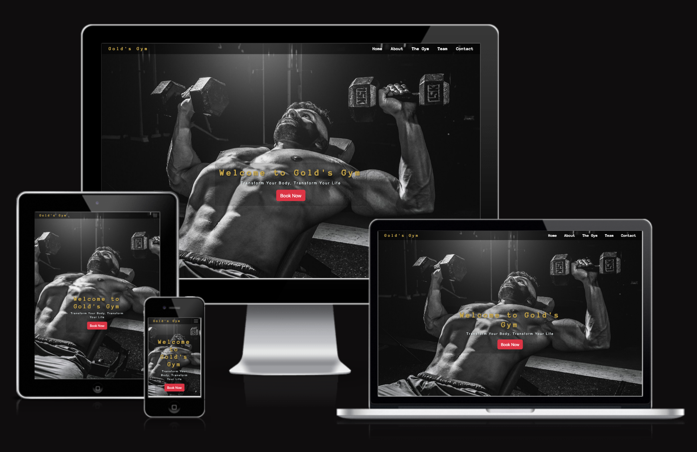
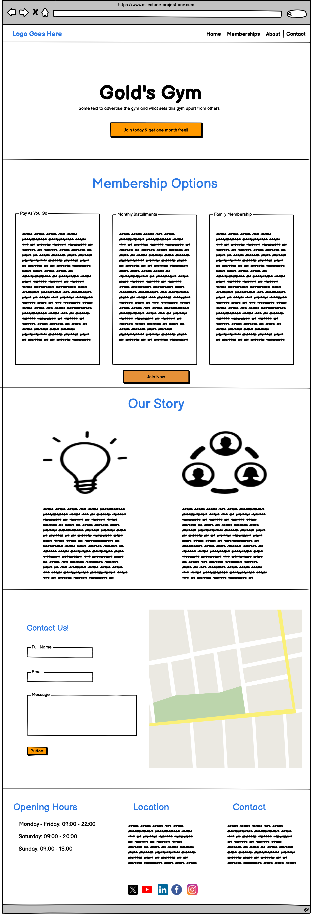
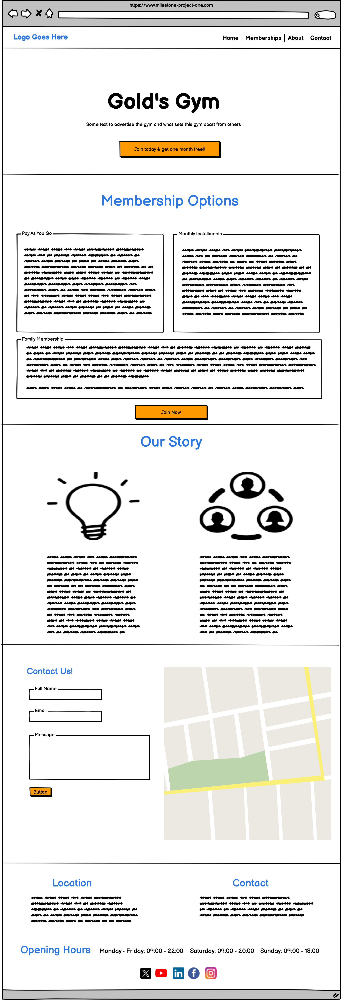
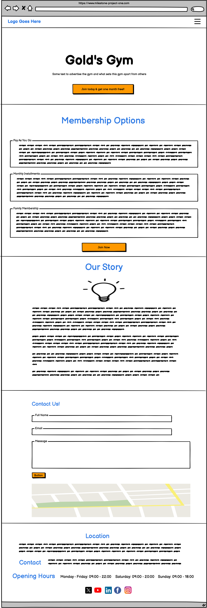
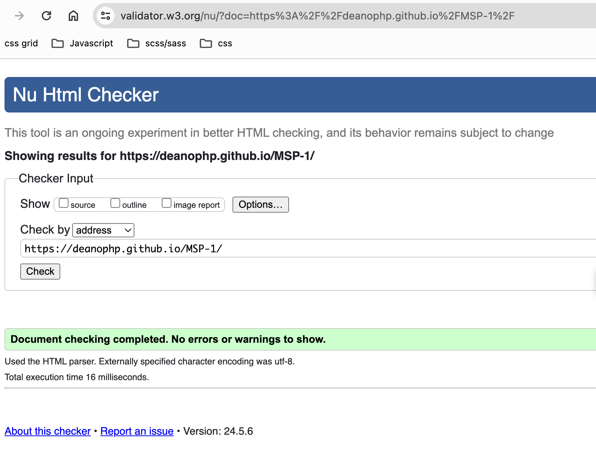
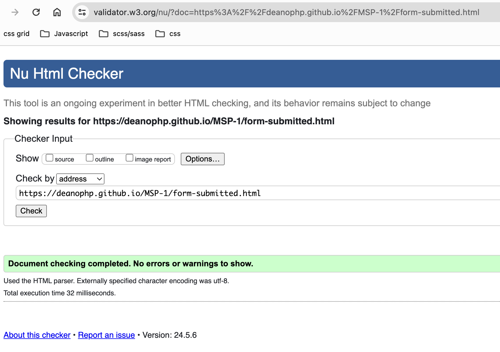
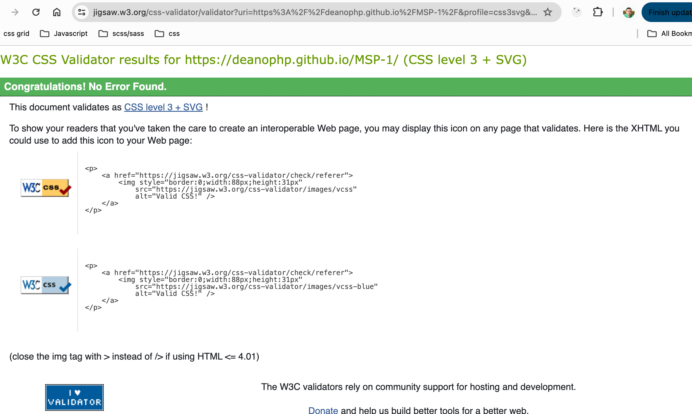
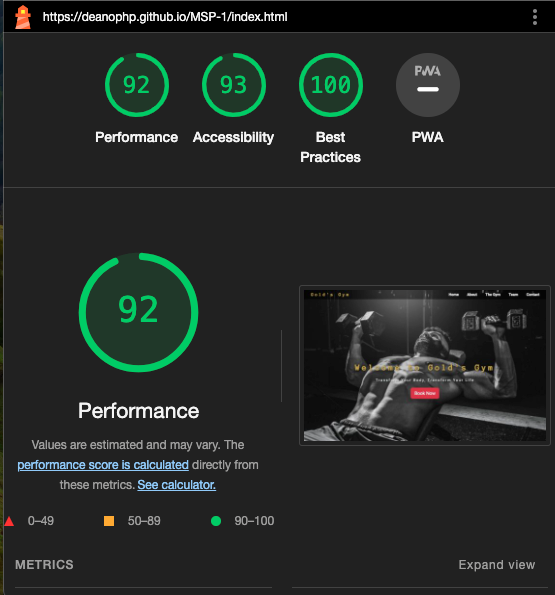
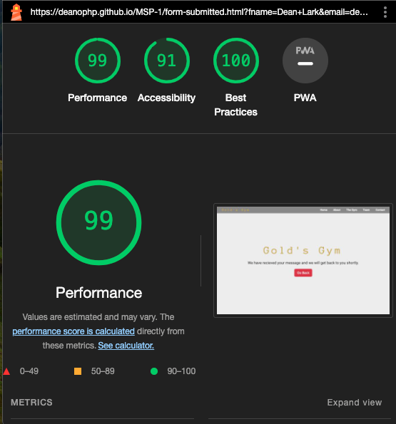

# Gold's Gym


[Click here to view the live website](https://deanophp.github.io/MSP-1/)

## Overview
Welcome to the repository for Gold's Gym, a modern and dynamic gym located at the heart of the city, dedicated to empowering individuals through fitness. Our website serves as a virtual extension of our physical space, providing visitors with detailed information about our facilities, services, and fitness programs. The website features responsive design, ensuring a seamless experience across all devices, from desktops to mobile phones.

This is a fictitious gym website created as part of a Web Development course with Code Institute. It has been designed to simulate a real-world application, this website serves as a showcase of my skills in HTML, and CSS.

## User Experience (UX)

### As a visitor
- As a visitor I want to be able to easily navigate the website so I can find information about the gym services, classes, opening times, and membership fees.
- As a visitor I want to see a well-organized presentation of all fitness classes before I join.
- As a visitor I want the website to be visually appealing and professionally styled so that I have a positive impression of the gym.
- As a visitor I want to be able to find the contact information easily so I can contact the gym to arrange a visit.
- As a visitor I want to easily find contact information so I can contact the gym with any questions.
- As a visitor I want to see a map of the gym's location.
- As a visitor I want to see a gallery showing the gym's facilities so I can see whether it meets my needs.
- As a visitor I would like to information about the gym staff.<br><br>
- As a visitor I want to to be able to use all my devices to view the gyms website so responsive design is a must.

### As a gym owner 
- As a gym owner, I want to feature high-quality images and detailed descriptions of our specialized equipment and facilities so that potential members can see we are well-equipped for serious bodybuilders.

- As a gym owner, I want to highlight our personalized training programs on the website, including details about our expert trainers and their bodybuilding expertise, to attract members looking for guidance and advanced workout strategies.

- As a gym owner, I want to to give the user a clear way to join

### As a returning user 
- As a returning user, I want to quickly book personal training sessions through the website, so I can ensure consistent progress and availability with my preferred trainers.
- As a returning user, I want to easily view and manage my membership details, such as renewal dates and payment methods, to keep my account in good standing without any administrative hassles.
- As a returning user, I want to easily find and sign up for upcoming events and competitions hosted by the gym, ensuring I never miss out on key community activities.
- As a returning user, I want to easily provide feedback about the gym's facilities, trainers, or services through the website, to ensure that my voice is heard and that the quality of the gym continues to improve.

## Skeleton
Wireframes were designed using [Balsamiq](https://balsamiq.cloud/#)
<br><br>

| Desktop                                   | Tablet                                  | Mobile                                  |
| ----------------------------------------- | --------------------------------------- | --------------------------------------- |
|  |  |  |

## Technologies and Tools
- HTML/CSS - For stucturing and design
- Bootstrap - Framework for designing responsive and mobile-first web pages.
- Animate.css - For visual effects
- FontAwesome - For icons
- Google Fonts - For fonts
- [Pixabay](https://pixabay.com) - For images
- Gitpod
- Github
- Visual Studio

## Design Overview

The website for Gold's Gym is crafted as a single-page layout to provide a streamlined, user-friendly experience. This design approach eliminates the need for a back button, as all content is accessible from a single page. To enhance navigation and accessibility, the navbar is fixed at the top of the page, ensuring that users can easily move between sections without scrolling back to the top.

### Imagery and Layout
- Hero Image: At the forefront of the homepage is a compelling hero image of a bodybuilder, chosen for its motivational impact and relevance to the fitness theme.
- Responsive Navigation: Utilizing Bootstrap, the navbar is designed to be responsive across devices. On smaller screens, it transforms into a hamburger menu, making it functional and space-efficient without sacrificing accessibility.

### Section Design
Gym Section: The gym section features a black background, which not only adds visual depth but also creates a seamless transition from the dark tones of the hero image. This design decision maintains a cohesive flow throughout the site, preventing abrupt changes in the visual experience.

### Color Palette
  - Gold: #C7A64A - Used for h1 tags and logo;
  - Dark shade of yellow-green #5C501F - Used for sub-headings;
  - Light grey: #fafafa - Used for links;
  - very light grey: #eeeeee - used for body;

### Font Usage

Our project utilizes a combination of FontAwesome, Roboto, and Anonymous Pro to ensure clear readability, aesthetic appeal, and functional design across all elements of our website.

### Fonts Details

- **Google Fonts**: Used primarily for icons across the website. FontAwesome provides scalable vector icons that can instantly be customized — size, color, drop shadow, and anything that can be done with the power of CSS.

- **Roboto**: This is the primary typeface used for text elements on the website. Designed for readability, Roboto offers a modern, neutral look with a wide range of weights and styles.

- **Anonymous Pro**: Employed mainly in code snippets and data displays, Anonymous Pro is a monospace font that offers excellent clarity and readability in technical sections of the website.

### Font Integration

To integrate and use these fonts in your development environment, follow these steps:

- **fonts.google.com**:
  ```css
    /* Importing Roboto font with all weights and styles */
    @import url('https://fonts.googleapis.com/css2?family=Roboto:ital,wght@0,100..900;1,100..900&display=swap');

    /* Importing Anonymous Pro font with specific weights and styles */
    @import url('https://fonts.googleapis.com/css2?family=Anonymous+Pro:ital,wght@0,400;0,700;1,400;1,700&display=swap');

- [Link for Roboto](https://fonts.google.com/?query=roboto)
- [Link for Anonymous Pro](https://fonts.google.com/?query=anonymous+pro)


Anonymous Pro and Roboto make a highly functional pairing in digital design, combining clarity with versatility. Anonymous Pro, a monospaced font, offers exceptional readability for code snippets and data, ensuring that each character is distinctly spaced and easy to differentiate. This makes it ideal for technical contexts where precision in text presentation is crucial. Roboto, on the other hand, is a sans-serif font known for its clean lines and friendly appearance, making it suitable for more general text such as paragraphs, headings, and user interfaces. Together, these fonts provide a balanced aesthetic: Roboto enhances the visual appeal and ease of reading for narrative text, while Anonymous Pro ensures technical sections are approachable and clear. This combination is particularly effective in environments like technical blogs, programming interfaces, or any application where text clarity and user comfort are paramount.

### Implementation

Here is an example of how to apply colours and fonts:

```css
:root {
    --link-font-color: #fafafa;
    --gold-color: #C7A64A;
    --sub-heading-color: #5C501F;
    --font-family-body: "Roboto", sans-serif;
    --h1-font-family: "Anonymous Pro", sans-serif;
}

.navbar-brand {
    font-family: var(--h1-font-family);
    color: var(--gold-color);
}
```

### Images
The images used in this project are sourced from various providers and are used under their respective licenses. Here are the details:

- **Hero Image**:
  - **Source**: [Pixabay](https://pixabay.com/photos/man-workout-dumbbell-muscle-biceps-5883500/)
  - **Artist**: [Artist's Name](Ai Generated Man Workout royalty-free stock illustration.)
  - **License**: [License Details](https://pixabay.com/service/license-summary/)

- All the other images were from a friend who owns a gym in Weston Super Mare

## Future features
- Navbar style when scrolling
- Gallery with better functionality
- Register and login system
- Bookings system
- Access My Membership Information
- Track My Workout Progress
- Purchase Supplements Online
- Online support

## Assistance from AI
During the development of this project, AI-powered tools were utilized to assist with including the design and implementation of a transparent navbar using Bootstrap. This assistance helped to optimize the solution and implement best practices in web development.

### Specific AI Contributions
- **Bootstrap Navbar Transparency**: AI provided guidance on how to adjust the `background-color` property using RGBA values to achieve the desired level of transparency in the navbar.
- **Media Queries**: AI provided me with the media queries for Ipad Pro. I was still unable to get the Ipad Pro media query to work in landscape. I used the below code

```
@media only screen 
  and (min-device-width: 1366px) 
  and (max-device-width: 1366px) 
  and (min-device-height: 1024px) 
  and (max-device-height: 1024px) 
  and (-webkit-min-device-pixel-ratio: 2) 
  and (orientation: landscape) {
    /* Your CSS rules here */
    body {
        background-color: lightgreen; /* Example rule for testing */
    }
}
```

## Testing
[w3c Markup Validation](https://validator.w3.org/)

index.html


form-submitted.html


style.css


## Functional Testing
| Action | Expected Behaviour | Pass/Fail |
| ------ | ------------------ | --------- | 
| Initial page load | I expect the browser to load my website and be on the index section | Pass |
| Home link | The browser should navigate to and display the 'Home' section. | Pass |
| About link | The browser should navigate to and display the 'About' section. | Pass |
| The Gym link | The browser should navigate to and display the 'Gym' section. | Pass |
| Team link | The browser should navigate to and display the 'Team' section. | Pass |
| Contact link | The browser should navigate to and display the 'Contact' section. | Pass | 
| Test for hero section Button | Upon clicking the button, the Bootstrap modal should be displayed, including all its content and with the correct styling. | Pass |
| Test for team section Button | Upon clicking the button, the Bootstrap modal should be displayed, including all its content and with the correct styling. | Pass |
| Test for Contact Section Button | Implemented functionality test to verify that clicking the button in the contact section redirects to the "form-submitted.html" page when all form inputs are filled out as expected. | Pass |
| Test Full Name required | Implemented functionality to verify whether form would submit if the input field is empty | Pass | 
| Test Email required | Implemented functionality to verify whether form would submit if the input field is empty | Pass | 
| Test Tel required | Implemented functionality to verify whether form would submit if the input field is empty | Pass | 
| Test Message required | Implemented functionality to verify whether form would submit if the input field is empty | Pass | 
| Implement Iframe map functionality | Added functionality test to ensure that the iframe map in the contact section functions correctly, displaying the map as expected and allowing interaction with it. | Pass |

## Lighthouse report
<hr>

### Single Page Navigation 
index.html, about section, gym section, team section, contact section



form-submitted.html



## Deployment
<hr>

1. **Design the Website on GitPod**:
   - Open GitPod and create a new workspace.
   - Design and develop your website within the GitPod environment.

2. **Push the Website to GitHub**:
   - Initialize a Git repository in your GitPod workspace:
     ```sh
     git init
     ```
   - Add all the project files:
     ```sh
     git add .
     ```
   - Commit the changes with a meaningful message:
     ```sh
     git commit -m "Initial commit"
     ```
   - Add your GitHub repository as a remote:
     ```sh
     git remote add origin <your-github-repo-url>
     ```
   - Push the changes to GitHub:
     ```sh
     git push -u origin main
     ```

## Cloning this repository

1. Open your prefered terminal.

2. Navigate to the directory where you want the cloned directory to be added.

3. Run the following command 
```sh
git clone https://github.com/DeanoPHP/MSP-1.git
```

4. After cloning, navigate into the directory
```sh
 cd your-repository-name
```

5. Now you can start working on the project on your local machine.

## Forking this repository
1. Go to the repository on GitHub.

2. In the top-right corner of the page, click the "Fork" button.

3. Once the repository has been forked, you will be taken to your copy of the repository in your GitHub account.

4. Clone your forked repository to your local machine:
```sh
git clone https://github.com/your-username/your-repository-name.git
```

5. Navigate to the cloned directory
```sh
  cd your-repository-name
```

6. You can now make changes to your fork and submit pull requests to the original repository.

## Deployment Steps
<hr>

**Deploy to GitHub Pages**:
   - Go to your GitHub repository on GitHub.
   - Navigate to the repository settings.
   - Scroll down to the "GitHub Pages" section.
   - Under "Source", select the branch you want to deploy (usually `main` or `gh-pages`).
   - Click "Save".

Your website should now be live on GitHub Pages. You can access it via the URL provided in the GitHub Pages section of your repository settings.

## Credits and Acknowledgments
<hr>
I would like to express my heartfelt gratitude to my mentor for his invaluable guidance and advice throughout this project. 

Additionally, I extend my sincere thanks to my tutors, especially Miguel Ortega Legorreta, for their exceptional teaching and encouragement. Your dedication and expertise have greatly contributed to my learning journey.


